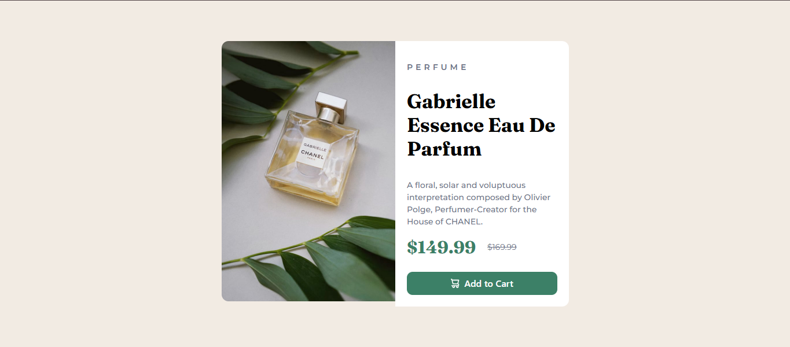

# Frontend Mentor - Product preview card component solution

This is a solution to the [Product preview card component challenge on Frontend Mentor](https://www.frontendmentor.io/challenges/product-preview-card-component-GO7UmttRfa). Frontend Mentor challenges help you improve your coding skills by building realistic projects. 

### The challenge

Users should be able to:

- View the optimal layout depending on their device's screen size
- See hover and focus states for interactive elements

### Screenshot

### Links

- Solution URL: [Add solution URL here](https://your-solution-url.com)
- Live Site URL: [Add live site URL here](https://your-live-site-url.com)

## My process

- First Created HTML Strucute
- Styles through TailwindCSS

### Built with

- Semantic HTML5 markup
- Tailwindcss CSS
- Flexbox
- Mobile-first workflow

### What I learned

Even though I had used HTML and Tailwind CSS before, revisiting this project helped me:

- Regain fluency with utility-first CSS and layout structure using Tailwind
- Practice writing cleaner and more semantic HTML
- Work with responsive images using the `hidden` and `block` classes based on screen size
- Refresh best practices like accessibility (`alt` text, button semantics)
- Build muscle memory for spacing, sizing, and card-based UI design

## Author

- Twitter - [@abusufyan_03](https://www.twitter.com/abusufyan_03)

